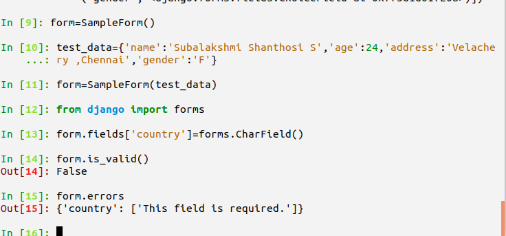

# Task One - creating a Custom Form Layout

# Django basics

1. Creating a django workspace

      Command -

              > django-admin.py startproject formmason
              > cd formmason
              > python manage.py startapp main

              __Note__:

                    Add the main as
                    # Register your custom app here
                    'main',
                    in INSTALLED_APPS in settings.py

2. Creating Python Virtual Environment:

      Command -

              > python3 -m venv myvenv
              > source myvenv/bin/activate
              > deactivate (to deactivate)

3. Installing Django if not present earlier:

     Command -
             > python -m pip install --upgrade pip
             > Create requirements.txt as
                    formmason
                    |_______ requirements.txt

                    Contents - Django~=2.0.6
            > pip install -r requirements.txt


4. Using Form interface of Django

   Form class Either Bound or UnBound

          Bound - Validation + Rendering
          UnBound - Rendering

      > python manage.py shell
      > from main.forms import SampleForm
      > form=SampleForm()
      > form.fields
      > OrderedDict([('name', <django.forms.fields.CharField at 0x7f3d1d019e10>),
             ('age', <django.forms.fields.IntegerField at 0x7f3d1d01f6d8>),
             ('address', <django.forms.fields.CharField at 0x7f3d1d01f470>),
             ('gender', <django.forms.fields.ChoiceField at 0x7f3d1d01f208>)])


# Use of Ordered Dict Type in Django

Unlike the traditional Dictonary - the fields of Form are of type
__Ordered Dictionary__

This is to preserve the order of insertion of field while writing forms.py


# Form Learning -

1. Fields attribute mapping to appropriate type of Field classes.
2. Fields attributes are not accessible by Form class object.
3. Addition to field Dictonary on object creation.
4. Addition of new field not possible directly in class.


# Adding an extra field to a SampleForm instance


# Generating dynamic forms

Using JSON type description to populate model


Form JSON for democratic information gathering for a person :

```json
{
 "name": "string",
 "age": "number",
 "city": "string",
 "country": "string",
 "time_lived_in_current_city": "string"
}
```
