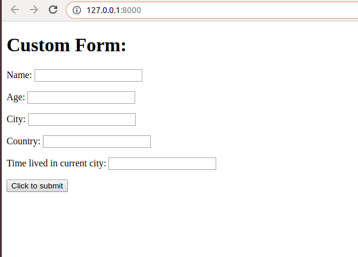
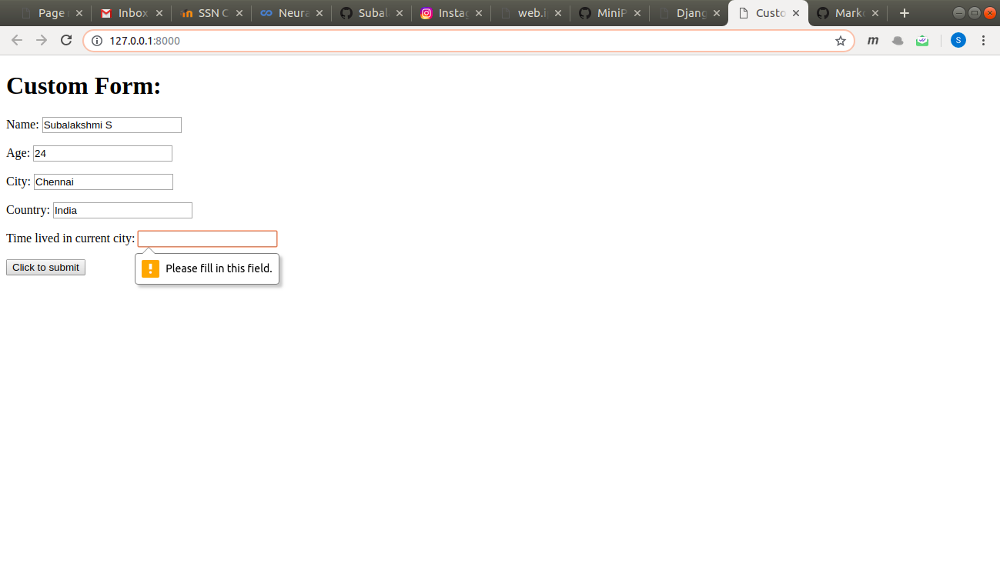
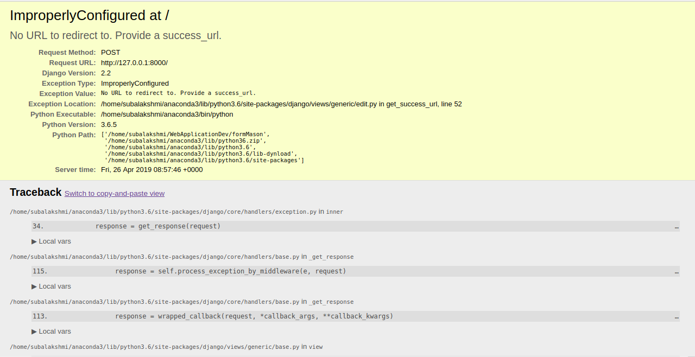
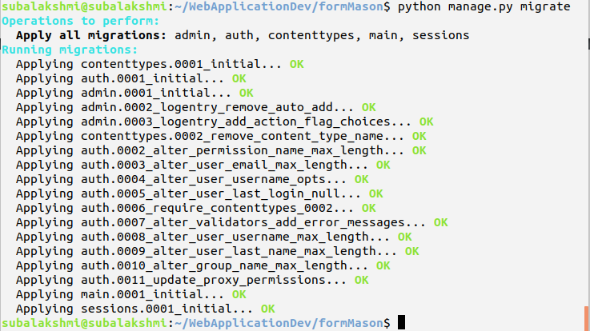
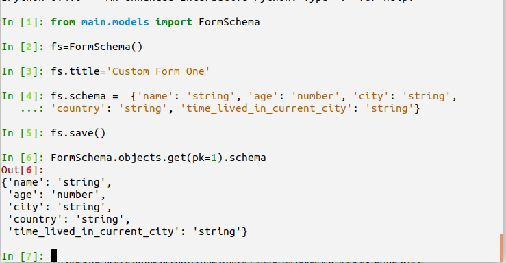
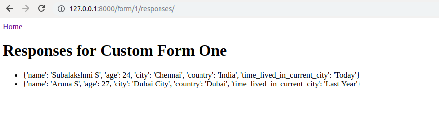
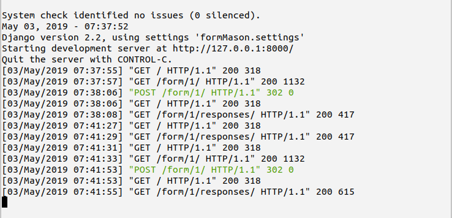
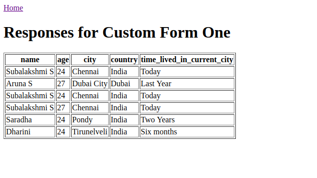
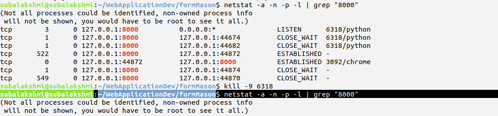

# Task One - creating a Custom Form Layout

# Django basics

1. Creating a django workspace

      Command -

              > django-admin.py startproject formmason
              > cd formmason
              > python manage.py startapp main

              __Note__:

                    Add the main as
                    # Register your custom app here
                    'main',
                    in INSTALLED_APPS in settings.py

2. Creating Python Virtual Environment:

      Command -

              > python3 -m venv myvenv
              > source myvenv/bin/activate
              > deactivate (to deactivate)

3. Installing Django if not present earlier:

     Command -
             > python -m pip install --upgrade pip
             > Create requirements.txt as
                    formmason
                    |_______ requirements.txt

                    Contents - Django~=2.0.6
            > pip install -r requirements.txt


4. Using Form interface of Django

   Form class Either Bound or UnBound

          Bound - Validation + Rendering
          UnBound - Rendering

      > python manage.py shell
      > from main.forms import SampleForm
      > form=SampleForm()
      > form.fields
      > OrderedDict([('name', <django.forms.fields.CharField at 0x7f3d1d019e10>),
             ('age', <django.forms.fields.IntegerField at 0x7f3d1d01f6d8>),
             ('address', <django.forms.fields.CharField at 0x7f3d1d01f470>),
             ('gender', <django.forms.fields.ChoiceField at 0x7f3d1d01f208>)])


# Use of Ordered Dict Type in Django

Unlike the traditional Dictonary - the fields of Form are of type
__Ordered Dictionary__

This is to preserve the order of insertion of field while writing forms.py


# Form Learning -

1. Fields attribute mapping to appropriate type of Field classes.
2. Fields attributes are not accessible by Form class object.
3. Addition to field Dictonary on object creation.
4. Addition of new field not possible directly in class.


# Adding an extra field to a SampleForm instance


# Generating dynamic forms

Using JSON type description to populate model


Form JSON for democratic information gathering for a person :

```json
{
 "name": "string",
 "age": "number",
 "city": "string",
 "country": "string",
 "time_lived_in_current_city": "string"
}
```

```json
{
  "name":"string",
  "regNo":"number",
  "catOne":"number",
  "catTwo":"number",
  "catThree":"number"
}
```


# Explanation of Handlebar and the functionality written in custom_form.html and views.py respectively


Functionality in views.py :

  1. Importing FormView from django

  2. Importing forms from django

  3. Loading custom form by :

  3.1 Creating custom_form_json with the above specification

  3.2 Loading the custom_form_json using json.loads() method

  3.3 Get the base Form object by

```python
  custom_form=forms.Form(**self.get_form_kwargs())
```
   3.4 Interate through Each form json items

  3.5 Check for the data type of Field and return that appropriate __forms.type__ :

```python
get_field_class_from_type(self,value_type)
# Returning forms.IntegerField if number type
# Returning forms.CharField if string Type
# Else returns None
```

4. Create template - __custom_form.html__

5. Above template file Has a form with a field Submit whose __action__ is not defined and __method__ is __post__

6. The template also has two Handlebar variables namely
        {}
        {{ form.as_p }}

7. Include the above template path in __urls.py__  as :
```python
from main.views import CustomFormView
from django.urls import path
from django.conf.urls import url
urlpatterns = [
  url(r'^$', CustomFormView.as_view(), name='custom-form'),
  ]
```

# Outcome - CustomForm


# Form Inplace validation for absence of Fields



# ImproperlyConfigured: No URL to redirect to. Provide a success_url error

Error cause : Using generic FormView which expects a success_url for URL redirection.




# TODO : Customisation

1. Custom Validation of Form
2. Form with a nice UI for pick list a option from limited dropdown fields


# A model for our JSON - models - Data base design

requirements - django-jsonfield

> pip install jsonfield

# Usage - django-jsonfield

```python
from django.db import models
from jsonfield import JSONField

class MyModel(models.Model):
  json = JSONField()
```

Changes in __models.py__

```python
from __future__ import unicode_literals
from django.db import models
from jsonfield import JSONField
# Create your models here.


# Creation of one database field  title
class FormSchema(models.Model):
    title=models.CharField(max_length=100)
    schema=JSONField()

```

# Running migrations:

> python manage.py makemigrations main

> python manage.py migrate




# Using created Model :



# Write a python code how to populate table with objects - refer tango with django

# Creating a better user interface

1. In settings.py add the location of templates folder

```python
TEMPLATES = [
    {
        'BACKEND': 'django.template.backends.django.DjangoTemplates',
        'DIRS': [
           os.path.join(BASE_DIR,'templates'),
        ],
        'APP_DIRS': True,
        'OPTIONS': {
            'context_processors': [
                'django.template.context_processors.debug',
                'django.template.context_processors.request',
                'django.contrib.auth.context_processors.auth',
                'django.contrib.messages.context_processors.messages',
            ],
        },
    },
]
# In which DIRS is specified with the templates directory.
```

2. In main/templates/base.html : Add the Home url and a block Handlebar variable

3. In main/templates/home.html :
   Add a link to this form_responses

     Extends base.html

    Iterating forms in object_list

    Linking to custom_form and form_responses in a unordered list.

4. In custom_form.html :
    Change the form body as Handlebar variable customisable.

```html
{{ form.as_p }}
<!-- In Form body -->
```

5. Changes in views.py -


```python
from django.views.generic import ListView
class HomePageView(ListView):
    model=FormSchema
    template_name="home.html"
```


# Error on rendering


Solution : Change in url


```python
app_name = 'main'

urlpatterns = [
    url(r'^$', HomePageView.as_view() , name='home' ),
    url(r'^form/(?P<form_pk>\d+)/$', CustomFormView.as_view(),name='custom-form'),
    url(r'^form/(?P<form_pk>\d+)/responses/$', FormResponsesListView.as_view(), name='form-responses'),
]

# File urls.py in main directory (application directory)

```

```python
urlpatterns = [

    path(r'^admin/$', admin.site.urls),
    url(r'^main/', include('main.urls')),
    ]
# Changes in the urls.py to include the changes in urls of application directory
```


```python

# Changes in settings.py

ROOT_URLCONF="main.urls"

```
# Including successfull compilation screenshots:






# Saving Responses Migration :


# Adding in Models

```python
class FormResponse(models.Model):
    form=models.ForeignKey(FormSchema,on_delete=models.PROTECT)
    response=JSONField()

def is_form_valid(self,form):
    custom_form = FormSchema.objects.get(pk=self.kwargs["form_pk"])
    user_response = form.cleaned_data
    form_response = FormResponse(form=custom_form,response=user_response)
    form_response.save()
    return HttpResponseRedirect(reverse('home'))


```


> python manage.py makemigrations main

> python manage.py migrate


# Changes in CustomFormView to save responses

```python
form_structure=FormSchema.oobjects.get(pk=1).schema


```


# Importing table view of responses


Changes in form_responses html page -

        Iterate through the field objects in Handlebar to view as rows in table - object_list - in which the entries are field_value within response attr  of object_list


```html


<h1>Responses for {{ form.title }}</h1>

  <table border="1px">
      <tr>
        
        <th>{{ field_name }}</th>
        
      </tr>

      <tr>
        
        <td>{{ field_value }}</td>
        
      </tr>

  </table>


```

Changes in views.py :

        Changes in method - get_context_data

               1. getting get_context_data of super FormResponsesListView.
               2. Getting form from self.
               3. Get form Fields as keys()
               4. Set the form_fields in headers attribute of context.
               5. Set form in headers attribute of context.
               6. Iterate through responses
               7. To append response_data[field_name]
               8. Add response_data to responses_list
               9. Set the object_list as responses_list



# Django General

1. Active port in use:




# TODO : Creating dynamic forms with schema in json format

# Designing a form creation interface

1. Enhanced User Experience -

             Drag and drop Fields

             Setting properties of fields by just clicking

# Designing a form creation interface

1. Changes in __forms.py__

              1. NewDynamicFormForm - class with following member variables and methods:
                       1.1 form_pk : CharField - required : False, HiddenInput
                       1.2 title : CharField - required : True,Normal Input
                       1.3 schema : CharField - required : True,Normal Input
                       1.4 Method clean_schema : To trying loading json schema and returning schema

2. Changes in __views.py__

              1. CreateEditFormView - class with following methods and instance variables

                     1.1 form_class- NewDynamicFormForm
                     1.2 template_name- create_edit_form.html
                     1.3 get_initial - get_initial Schema if FormSchema object exists else use new schema with title,form_pk and schema in JSON format , returns initial schema which was formed.
                     1.4  get_context_data - same purpose to use inherited reference to CreateEditFormView
                     1.5 form_valid =

                             * Get form cleaned_data
                             * Check if Any object already found
                             * Get Schema old with corresponding pk
                             * Set title
                             * Set Schema
                             * Save form schema

                            Flow Alternative
                             * New Form Flow  - Create new FormSchema
                             * Save Schema
                             * Return to home.html

 3. Changes in __create_edit_form.html__ :


 # Learning to use Django Bootstrap

```python
 pip install django-crispy-forms
```

Adding to settings.py :

```python
INSTALLED_APPS = [
    ...

    'crispy_forms',
]

CRISPY_TEMPLATE_PACK = 'bootstrap4'
```


# Populate db using django-admin loaddata

# Steps to take dump of all entries in Database


> ./manage.py dumpdata main > formMason.json
